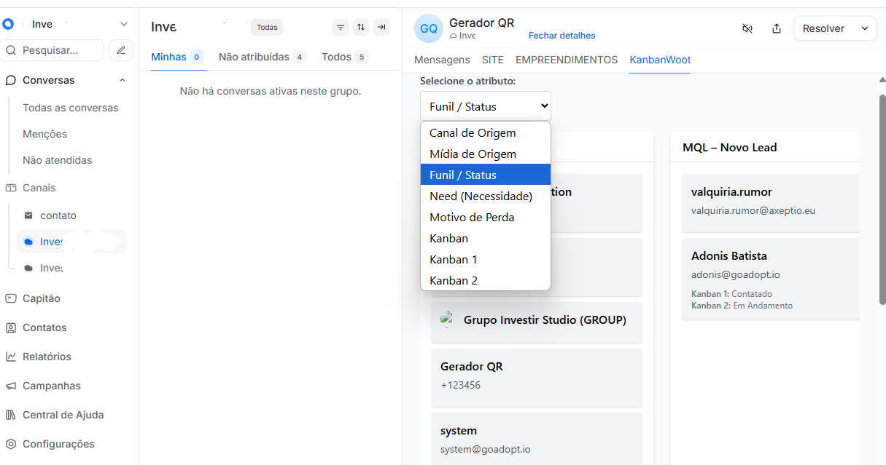

# 🧩 Kanbanwoot

Interface web estilo Kanban integrada ao **Chatwoot**, utilizando campos personalizados do tipo lista para visualizar e mover contatos entre etapas diretamente na interface.



## 🚀 Funcionalidades

- 📥 Carrega todos os contatos do Chatwoot (não apenas os que têm atributo kanban)
- 🔄 Estágios/colunas definidos dinamicamente pelos valores cadastrados em qualquer campo customizado do tipo lista
- 🧲 Interface com drag and drop usando `@hello-pangea/dnd`
- ⚡ Atualização em tempo real com API REST do Chatwoot
- 🎨 UI moderna com Tailwind CSS
- 🏷️ Suporte a múltiplos atributos customizados do tipo lista (dropdown para seleção do atributo)
- 🗂️ Coluna especial "Não definido" para contatos sem valor definido no atributo
- 📝 Exibição dos nomes amigáveis dos atributos e valores (display_name)
- 🖱️ Atualização do estágio do contato ao arrastar (remove a chave do atributo ao mover para "Não definido")
- 🔄 Board recarrega automaticamente após qualquer atualização
- 🧩 Código modular e otimizado (hooks, memoização, sem requisições duplicadas)
- 🏷️ Exibição de todos os atributos customizados do contato (com nomes amigáveis)
- 🛠️ Responsividade e acessibilidade aprimoradas
- 🐞 Notificações de erro/sucesso ao mover cards

---

## 🛠 Tecnologias

- React (com Hooks)
- Tailwind CSS
- Axios
- Chatwoot API
- @hello-pangea/dnd

---

## 📦 Instalação

```bash
git clone https://github.com/seu-usuario/kanbanwoot.git
cd kanbanwoot
npm install
```

### 🌐 Variáveis de Ambiente

Crie um arquivo `.env` na raiz do projeto com as credenciais da API do Chatwoot:

```env
REACT_APP_CHATWOOT_TOKEN=seu_token_aqui
REACT_APP_ACCOUNT_ID=1
REACT_APP_API_URL=https://app.chatwoot.com
REACT_APP_API_INBOX_ID=1
```

### ▶️ Rodar localmente

```bash
npm start
```

---

## 🛡️ Configuração do Chatwoot para uso externo (CORS/Easypanel)

Para que o KanbanWoot consiga acessar a API do Chatwoot hospedado em outro domínio (ex: via Easypanel, Docker, etc), é necessário liberar o CORS no backend do Chatwoot.

**Passo a passo:**

1. **Monte o arquivo de configuração do CORS no container do Chatwoot:**
   - Crie/edite o arquivo `/app/config/initializers/cors.rb` no servidor Chatwoot com o seguinte conteúdo:

```ruby
Rails.application.config.middleware.insert_before 0, Rack::Cors do
  allow do
    origins 'https://meu_kanbanwoot.com'

    resource '*',
      headers: :any,
      methods: [:get, :post, :put, :patch, :delete, :options, :head],
      credentials: true
  end
end
```

> **Dica:** Se estiver usando Docker, utilize a opção de montagem para garantir que o arquivo persista entre reinícios do serviço:
>
> - Caminho de montagem: `/app/config/initializers/cors.rb`
> - Conteúdo igual ao acima.
>
> **Dica:** No Easypanel, use a opção de "Montagem de Arquivo" para garantir que o arquivo persista mesmo após reiniciar o serviço.

2. **Reinicie o serviço do Chatwoot** para aplicar a configuração.

3. **Atenção:**
   - Altere o domínio em `origins` para o domínio real onde o KanbanWoot está hospedado.
   - Não utilize `*` em produção por questões de segurança.

4. **(Opcional) Ajuste o servidor Puma para aceitar conexões externas**

Se necessário, edite a configuração do Puma (`config/puma.rb`) para escutar em todas as interfaces:

```ruby
port ENV.fetch("PORT") { 3000 }, '0.0.0.0'
```

Assim, o Chatwoot aceitará conexões externas, facilitando a integração com o Kanbanwoot.

---

## 🐳 Deploy com Docker

Este projeto está pronto para ser publicado via Docker.

Exemplo de `Dockerfile` (já incluso no repositório):

```dockerfile
# build stage
FROM node:18-alpine as build
WORKDIR /app
COPY package*.json ./
RUN npm install
COPY . .
RUN npm run build

# production stage
FROM nginx:stable as production
COPY --from=build /app/build /usr/share/nginx/html
COPY ./dockerizer/nginx.conf /etc/nginx/conf.d/default.conf
EXPOSE 3000
CMD ["nginx", "-g", "daemon off;"]
```

Acesse a aplicação na porta 3000 após o deploy.

---

## 🖇️ Como incorporar o KanbanWoot no Chatwoot (Painel de Aplicativos)

Você pode exibir o KanbanWoot diretamente no painel lateral do Chatwoot para que os agentes tenham acesso rápido ao funil de contatos.

**Passo a passo:**

1. No Chatwoot, acesse:
   - **Configurações** > **Integrações** > **Painel de Aplicativos**
2. Clique em **Adicionar um novo aplicativo**.
3. Preencha os campos:
   - **Nome:** KanbanWoot
   - **Endpoint:** `https://meu_kanbanwoot.com/?kbw=funil_status`
     - Substitua pelo domínio real do seu KanbanWoot e pelo atributo desejado (ex: `funil_status`).
4. Salve. O KanbanWoot aparecerá como um painel lateral dentro do Chatwoot, fornecendo contexto visual e permitindo movimentação dos contatos sem sair do atendimento.

> O Painel de Aplicativos permite incorporar aplicações externas para fornecer informações adicionais ao agente, como histórico, pedidos ou status personalizado do cliente.

---

## 🔧 Melhorias futuras

- Filtragem por tags, agentes ou inbox
- Integração com histórico de conversas
- Login com autenticação de operadores Chatwoot
